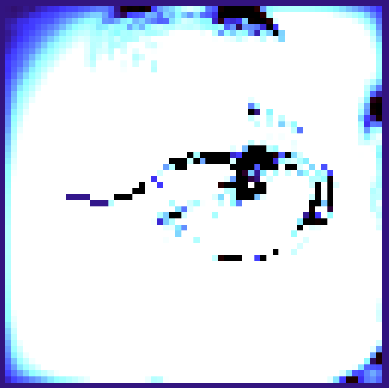

# esthetique-algorithme
# Atelier 1 - Dessin algorithmique
## Présentation
Le fichier atelier_1-2.js utilise des courbes de bézier. Les courbes ont toutes comme premier point d'ancrage le milieu de la fenêtre, le deuxième point est positionné aux coordonnées du curseur. Les poignées qui tirent la courbes sont aléatoires. L'utilisateur·rice peut donc placer lui même un point de la courbe pour dessiner.

Le fichier atelier_1-2-2.js dessine des points sur la fenêtre représentant du bruit. En fonction de la position du curseur, les points changent de position et de couleur.

## Exécution
Le projet est écrit sur [l'éditeur en ligne p5.js](https://editor.p5js.org/).
Pour le lancer, récupérer le contenu du fichier js, le coller dans l'éditeur et lancer le programme.

# Atelier 2 - Automate Cellulaire
## Présentation
Le projet est un automate cellulaire utilisant une équation de vague. L'état de chaque cellule correspond à la moyenne de ses voisines et de son état précédent. Un facteur d'amortissment permet de réduire la puissance de la vague.
Les vagues commencent à la case sur laquelle l'utilisateur·rice clique, ou "traîne" la souris.
Au bout d'un certains nombre d'itérations, les générations changent (voir les exemples 4 et 5 dans le dossier screenshot).

## Exécution
### Éditeur
Pour lancer le projet, récupérer le contenu du fichier js, le coller dans [l'éditeur en ligne p5.js](https://editor.p5js.org/) et lancer le programme.

### Local
Télécharger les fichier ca.js, p5.js et index.html. Ouvrir index.html (/!\ il faut que les 3 fichiers soient au même niveau).

# Atelier 3 - Fractales
## Présentation
Ce projet présente des caractéristiques de fractale par sa récursivité / répétition. Il représente, de manière un peu abstraite, des vaisseaux sanguins. Lors d'un clic sur la fenêtre, un son de battement de coeur est lancé.

## Exécution
### Local
La présence de fichiers audios nécessite d'utiliser un serveur pour lancer le projet.
Télecharger le dossier "fractals", et l'ouvrir avec VSCode. VSCode possède un petit serveur : faire un clic droit dans le fichier index.html, l'option "open with live server" devrait apparaître. Sinon, télecharger l'extension Live server sur VSCode.

