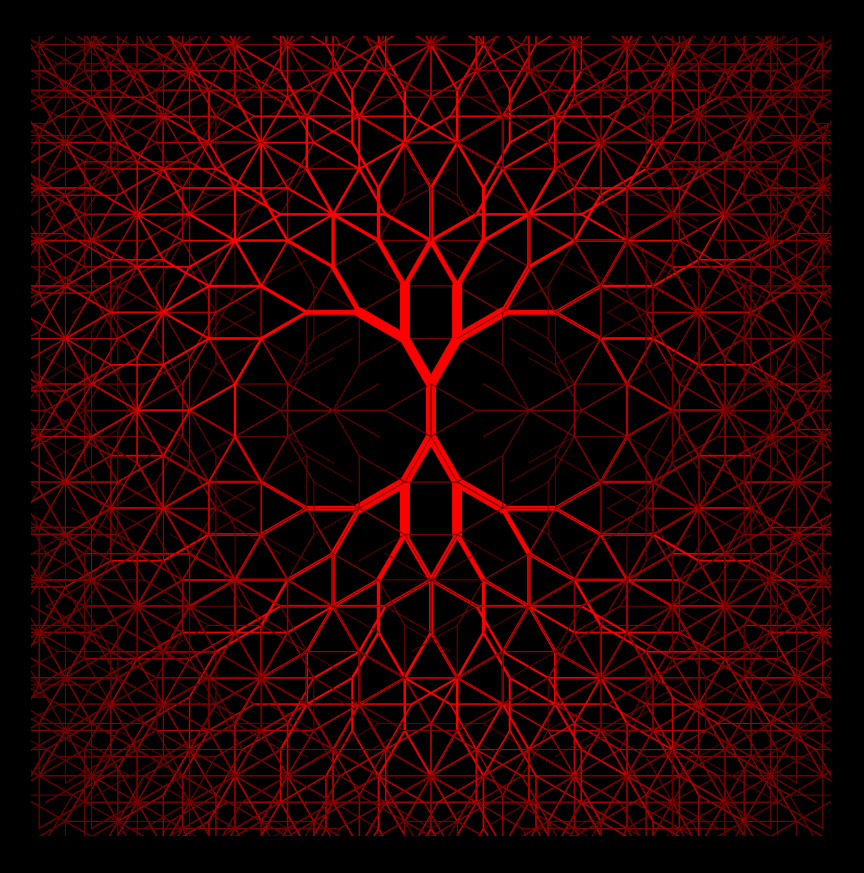

# Atelier 3
## Présentation
Ce projet présente des caractéristiques de fractale par sa récursivité / répétition. Il représente, de manière un peu abstraite, des vaisseaux sanguins. Lors d'un clic sur la fenêtre, un son de battement de coeur est lancé.

## Exécution
### Local
La présence de fichiers audios nécessite d'utiliser un serveur pour lancer le projet.
Télecharger le dossier "fractals", et l'ouvrir avec VSCode. VSCode possède un petit serveur : faire un clic droit dans le fichier index.html, l'option "open with live server" devrait apparaître. Sinon, télecharger l'extension Live server sur VSCode.

